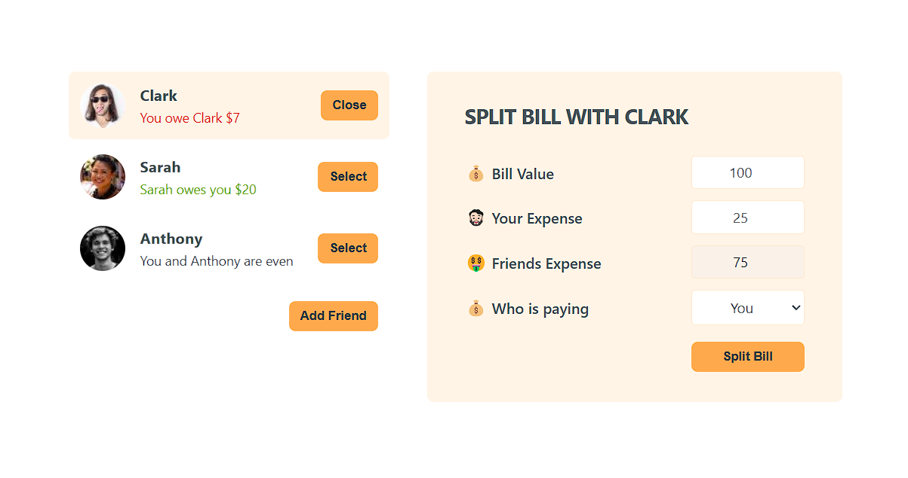

# Eat & Split

A simple and fun **React** app to **split bills** with friends!  
Add friends, track who owes who, and easily manage shared expenses. 🎉

---

## ✨ Features
- View a list of friends
- Add a new friend with a name and image
- Select a friend to split a bill with
- Enter bill details and update balances based on who paid
- Clean, minimal UI

---

## 🛠️ Tech Stack
- **React** (functional components + hooks)
- **CSS** for styling

---

## 📂 Project Structure
```
/src
 ├── /assets
 │    ├── Button.js
 │    ├── FriendList.js
 │    ├── FormAddFriends.js
 │    └── FormSplitBill.js
 ├── App.js
 ├── App.css
 └── index.js
```

---

## 🚀 Getting Started

1. Clone the repository:
   ```bash
   git clone https://github.com/your-username/eat-n-split-app.git
   ```

2. Navigate into the project directory:
   ```bash
   cd eat-n-split-app
   ```

3. Install dependencies:
   ```bash
   npm install
   ```

4. Start the development server:
   ```bash
   npm run dev
   ```

---

---

## 📸 Preview



> Example UI of the app in action

---

## ⚡ Future Improvements
- Persist data with **localStorage** or **backend API**
- Add "Delete Friend" feature
- Mobile responsiveness
- Dark/light theme toggle 🌗

---

## 🧑‍💻 Author

Made with ❤️ by [Dipan46](https://github.com/Dipan46)

## 📄 License

This project is open-source and available under the [MIT License](LICENSE).
